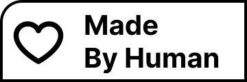
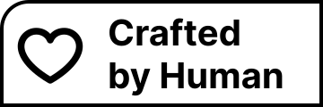

# Made by Human

**Made by Human** celebrates human creativity — not by rejecting AI, but by honoring the intention, judgment, and personal touch that humans bring to every creative project.

Created with heart, intent, and sometimes AI — but always by a human.

---

## 🎯 Purpose

*Made by Human* celebrates human creativity and the meaningful choices we make in our creative work.  
True value emerges when humans **choose**, **shape**, and **curate** their tools. Whether working entirely by hand or in collaboration with AI, the creative vision and decisions remain fundamentally human.

---

## 🧩 The Badge Series

Our badges represent this philosophy. They're free to use on websites, products, music, apps, and art projects — each one acknowledging a different nuance in how humans and machines work together.

Example badges:
- **Made by Human**  
- **Co-created with AI**  
- **Human in the Loop**  
- **Crafted by Human**  

---

## 🖼️ Badges

The project currently includes **eight SVG badges** — four in white and four in black — located in the `public/badges` directory.

| Preview | Filename |
|----------|-----------|
|  | `made-white.svg` |
|  | `co-created-white.svg` |
|  | `crafted-white.svg` |
|  | `loop-white.svg` |
|  | `made-black.svg` |
|  | `co-created-black.svg` |
|  | `crafted-black.svg` |
|  | `loop-black.svg` |

---

## 🧠 Project Structure

This repository is a **Next.js** project that serves as the foundation for:
- A single-page website that explains the project philosophy
- An interactive badge viewer where users can browse and preview all available badges
- Direct download functionality for SVG badges
- Embed code generation for badges (for use in GitHub README files, websites, or other projects)

### Technology Stack

- **Next.js 16** - React framework with App Router
- **Tailwind CSS v4** - Utility-first CSS framework (free and open source)
- **TypeScript** - Type-safe development
- **React 19** - UI library
- **Framer Motion** - Animation library for smooth interactions

### Embedding Badges

Badges can be embedded in multiple ways:

1. **GitHub README**: Use the raw GitHub URL or inline SVG
2. **Websites**: Use `` tags or inline SVG for better control
3. **Markdown**: Standard markdown image syntax works with hosted URLs

The website will provide copy-paste embed code for each badge variant.

---

## 🚀 Development

To start the project locally:

```bash
npm run dev
# or
yarn dev
```

Open [http://localhost:3000](http://localhost:3000) in your browser.

The main page is located in `app/page.tsx` and will auto-update during development.

---

## 🧭 Website Structure

The website is a fully responsive single-page application featuring:

1. **Hero Section** - Large, impactful introduction with interactive grid pattern that responds to mouse movement
2. **Manifest** - Brief explanation of the philosophy with side-by-side layout
3. **Select your badge** - Interactive preview of all badges with download and embed functionality, smooth animations
4. **How to Use** - Instructions for downloading and embedding badges
5. **Contributing** - Information on how to contribute to the project

### Design Features

- **Style**: Minimalist and modern with subtle animations
- **Color Palette**: Zinc and black tones with accent color (#F59898) for badge previews
- **Responsive**: Fully responsive design for all devices (mobile, tablet, desktop)
- **Interactive Elements**: 
  - Grid pattern that brightens near mouse cursor (desktop only)
  - Smooth scroll-triggered animations using Framer Motion
  - Hover effects on interactive elements
  - Touch device detection for optimal performance
- **Layout**: Side-by-side layout for headings and content on desktop for better visual alignment
- **Badge Display**: 2-column grid layout on desktop, 1-column on mobile

### Accessibility & User Experience

- **Keyboard Navigation**: Full keyboard support including ESC to close modals and Tab navigation
- **Focus Management**: Focus trap in modals for better accessibility
- **ARIA Labels**: Proper ARIA attributes for screen readers
- **Error Handling**: Graceful error handling for clipboard operations and downloads
- **Touch Support**: Optimized experience for touch devices with disabled mouse tracking
- **Feedback**: Clear visual feedback for user actions (copy, download, etc.)  

---

## ❤️ Contributing

Everyone is welcome to contribute — bring your badges, ideas, text, design, or code.  
Our goal is to **celebrate the human** in every creative process, whether that process includes AI or not.

---

## 🌐 License

This project is open source under the MIT License.  
Share, remix, and build upon it — but remember to credit the humans behind it.
