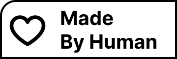
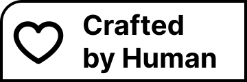

# Made by Human

**Made by Human** celebrates human creativity — not by rejecting AI, but by honoring the intention, judgement, and personal touch that humans bring to every creative project.

Created with heart, intent, and sometimes AI — but always by a human.

---

## 🎯 Purpose

*Made by Human* celebrates human creativity and the meaningful choices we make in our creative work.  
True value emerges when humans **choose**, **shape**, and **curate** their tools. Whether working entirely by hand or in collaboration with AI, the creative vision and decisions remain fundamentally human.

---

## 🧩 The Badge Series

Our badges represent this philosophy. They're free to use on websites, products, music, apps, and art projects — each one acknowledging a different nuance in how humans and machines work together.

Example badges:
- **Made by Human**  
- **Co-created with AI**  
- **Human in the Loop**  
- **Crafted by Human**  

---

## 🖼️ Badges

The project currently includes **eight SVG badges** — four in white and four in black — located in the `public/badges` directory.

### Badge Descriptions

- **Made by Human** - A general badge celebrating human creativity in all forms
- **Co-created with AI** - For projects created in collaboration with AI tools
- **Crafted by Human** - For projects created entirely by human hands
- **Human in the Loop** - For projects where humans guide and curate the creative process

### Badge Files

| Preview | Filename | Description |
|----------|-----------|-------------|
|  | `made-white.svg` | General badge celebrating human creativity |
|  | `co-created-white.svg` | For AI collaboration projects |
|  | `crafted-white.svg` | For entirely human-made projects |
|  | `loop-white.svg` | For human-guided creative processes |
|  | `made-black.svg` | General badge celebrating human creativity |
|  | `co-created-black.svg` | For AI collaboration projects |
|  | `crafted-black.svg` | For entirely human-made projects |
|  | `loop-black.svg` | For human-guided creative processes |

---

## 🧠 Project Structure

This repository is a **Next.js** project (static export to GitHub Pages) with three routes:

| Route | File | Description |
|-------|------|-------------|
| `/` | `src/app/page.tsx` | Homepage: hero, philosophy, badge gallery modal, how-to, contributing |
| `/about` | `src/app/about/page.tsx` | Origin story, "Intention Over Purity" philosophy, future vision |
| `/badges` | `src/app/badges/page.tsx` | Full badge gallery with descriptions, use cases, download + embed codes |

### Shared Components
- **Nav** (`src/components/Nav.tsx`) — Navigation bar on all pages
- **Footer** (`src/components/Footer.tsx`) — Footer with cross-links on all pages
- **Badge data** (`src/lib/badges.ts`) — Single source of truth for badge names, descriptions, and use cases
- **Analytics** (`src/lib/umami.ts`) — Shared Umami event tracking helper
- **Config** (`src/app/config.ts`) — Centralized URL generation (base URL, badge URLs)

### Technology Stack

- **Next.js 16** - React framework with App Router (static export)
- **Tailwind CSS v4** - Utility-first CSS framework (free and open source)
- **TypeScript** - Type-safe development
- **React 19** - UI library
- **Framer Motion** - Animation library for smooth interactions

### Embedding Badges

Badges can be embedded in multiple ways:

1. **GitHub README**: Use the raw GitHub URL or inline SVG
2. **Websites**: Use `` tags or inline SVG for better control
3. **Markdown**: Standard markdown image syntax works with hosted URLs

The website provides copy-paste embed code for each badge variant (Markdown, HTML, or direct URL).

#### Badge URLs

All badges are hosted at: `https://madebyhuman.iamjarl.com/badges/[filename]-[variant].svg`

Examples:
- `https://madebyhuman.iamjarl.com/badges/made-white.svg`
- `https://madebyhuman.iamjarl.com/badges/co-created-black.svg`

---

## 🚀 Development

To start the project locally:

```bash
npm run dev
# or
yarn dev
```

Open [http://localhost:3000](http://localhost:3000) in your browser.

Pages are located in `src/app/` (homepage: `page.tsx`, about: `about/page.tsx`, badges: `badges/page.tsx`) and will auto-update during development.

---

## 🧭 Website Structure

The website is a fully responsive multi-page site with three routes:

### Homepage (`/`)
1. **Hero Section** — Large introduction with interactive grid pattern (mouse-responsive on desktop)
2. **Our Philosophy** — Brief explanation of the movement's philosophy
3. **Select your badge** — Interactive badge gallery with modal for download + embed
4. **How to Use** — Instructions for downloading and embedding badges
5. **Contributing** — Information on how to contribute to the project

### About (`/about`)
1. **The Origin** — Story behind "Made by Human" as a counterpoint to "Not By AI"
2. **Intention Over Purity** — Philosophy: it's not about how, it's about why
3. **The Badges** — Introduction with link to badge gallery
4. **Looking Forward** — Vision + open source contribution CTA

### Badges (`/badges`)
1. **Badge Gallery** — All 4 badges with full descriptions and "When to use" lists
2. **Per-badge sections** — White/black variant selector, SVG download, embed code copy (Markdown/HTML/URL)
3. **Anchor IDs** — Deep-linkable sections (`#made-by-human`, `#co-created-with-ai`, etc.)
4. **Contribute CTA** — GitHub link for new badge ideas

### Design Features

- **Style**: Minimalist and modern with subtle animations
- **Color Palette**: Zinc and black tones with accent color (#F59898) for badge previews
- **Responsive**: Fully responsive design for all devices (mobile, tablet, desktop)
- **Interactive Elements**: 
  - Grid pattern that brightens near mouse cursor (desktop only)
  - Smooth scroll-triggered animations using Framer Motion
  - Hover effects on interactive elements
  - Touch device detection for optimal performance
- **Layout**: Side-by-side layout for headings and content on desktop for better visual alignment
- **Badge Display**: 2-column grid layout on desktop, 1-column on mobile

### Accessibility & User Experience

- **Keyboard Navigation**: Full keyboard support including ESC to close modals and Tab navigation
- **Focus Management**: Focus trap in modals for better accessibility
- **ARIA Labels**: Proper ARIA attributes for screen readers
- **Error Handling**: Graceful error handling for clipboard operations and downloads
- **Touch Support**: Optimized experience for touch devices with disabled mouse tracking
- **Feedback**: Clear visual feedback for user actions (copy, download, etc.)  

---

## 🚢 Deployment

The website is automatically deployed to **GitHub Pages** using GitHub Actions. Every push to the `main` branch triggers a build and deployment.

### Live Site

The website is available at: **https://madebyhuman.iamjarl.com/**

### Deployment Process

1. Code is pushed to the `main` branch (via pull request)
2. GitHub Actions workflow builds the Next.js static export
3. The built site is deployed to GitHub Pages
4. The site is available at the GitHub Pages URL

### Build Configuration

- **Custom Domain**: `madebyhuman.iamjarl.com`
- **Output**: Static export (`output: 'export'`)
- **Images**: Unoptimized (required for static export)

### Branch Protection

The `main` branch is protected with the following rules:
- **Pull requests required**: All changes must be made through pull requests
- **Status checks required**: Build must pass before merging
- **Force push blocked**: Prevents accidental history rewriting
- **Branch deletion blocked**: Protects the main branch from accidental deletion

---

## 🔍 SEO & Metadata

The website includes comprehensive SEO optimization:

- **Open Graph** tags for social media sharing (per page)
- **Twitter Card** metadata
- **JSON-LD structured data** — WebSite, Organization, ItemList (4 badges), FAQPage (4 Q&As)
- **Canonical URLs** per page (`/`, `/about`, `/badges`)
- **Unique meta titles and descriptions** per page
- **Sitemap** (`public/sitemap.xml`) with all routes + auto-generation script
- **robots.txt** allowing full crawl with sitemap reference
- **Google Search Console** connected and verified
- **Umami analytics** with custom event tracking (badge downloads, embed copies)
- **Favicon** and icon files for all platforms
- **Accessibility** features (ARIA labels, keyboard navigation, focus trap)

For full SEO strategy and implementation details, see [SEO_STRATEGY.md](./SEO_STRATEGY.md).

---

## ❤️ Contributing

Everyone is welcome to contribute — bring your badges, ideas, text, design, or code.  
Our goal is to **celebrate the human** in every creative process, whether that process includes AI or not.

### How to Contribute

1. **Fork the repository** and create a new branch for your changes
2. **Make your changes** and test them locally
3. **Create a pull request** to the `main` branch
4. **Wait for status checks** to pass (build must succeed)
5. **Your PR will be reviewed** and merged once approved

All contributions must go through pull requests — direct pushes to `main` are not allowed to ensure code quality and maintain project stability.

---

## 🌐 License

This project is open source under the MIT License.  
Share, remix, and build upon it — but remember to credit the humans behind it.
