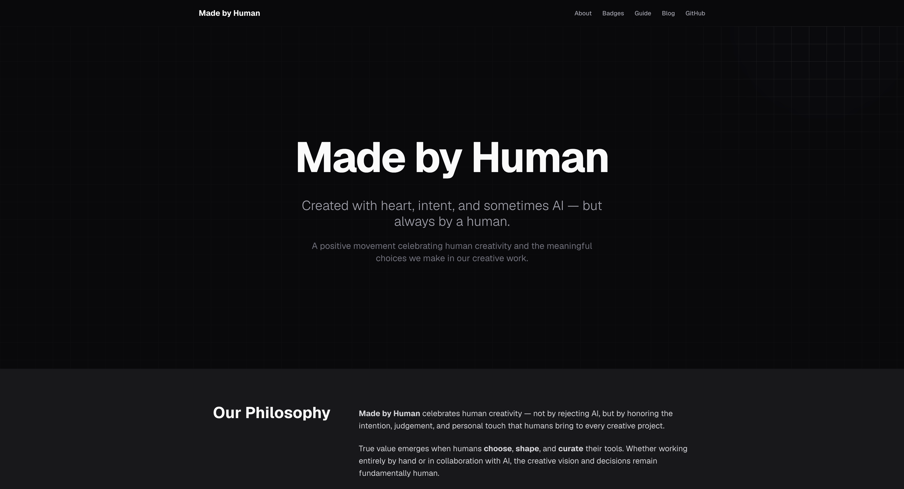

[](https://madebyhuman.iamjarl.com)

# Made by Human

[](LICENSE)
[](https://github.com/JarlLyng/madebyhuman/commits/main)
[](https://github.com/JarlLyng/madebyhuman/actions/workflows/deploy.yml)
[](https://github.com/JarlLyng/madebyhuman/issues)
[](https://madebyhuman.iamjarl.com)

**Celebrating human creativity — not by rejecting AI, but by honoring the intention, judgement, and personal touch that humans bring to every creative project.**

Free SVG badges for websites, GitHub READMEs, apps, and art projects. Open source under MIT.

**[Browse badges](https://madebyhuman.iamjarl.com/badges)** | **[About the project](https://madebyhuman.iamjarl.com/about)** | **[Read the blog](https://madebyhuman.iamjarl.com/blog)** | **[Live site](https://madebyhuman.iamjarl.com)**

[](https://madebyhuman.iamjarl.com)

---

## Badges

Eight SVG badges — four designs in white and black variants:

| Badge | Use when... |
|-------|-------------|
|  | A general badge celebrating human creativity in all forms |
|  | Your project involves collaboration with AI tools |
|  | The work was created entirely by human hands |
|  | Humans guide and curate an AI-assisted process |

All badges also available in black variant. See the [full gallery](https://madebyhuman.iamjarl.com/badges).

---

## Quick start

### Markdown (GitHub README)

```markdown
[](https://madebyhuman.iamjarl.com)
```

### HTML

```html
<a href="https://madebyhuman.iamjarl.com">
  
</a>
```

### Badge URLs

All badges hosted at: `https://madebyhuman.iamjarl.com/badges/[name]-[variant].svg`

| Badge | White | Black |
|-------|-------|-------|
| Made by Human | `made-white.svg` | `made-black.svg` |
| Co-created with AI | `co-created-white.svg` | `co-created-black.svg` |
| Crafted by Human | `crafted-white.svg` | `crafted-black.svg` |
| Human in the Loop | `loop-white.svg` | `loop-black.svg` |

Or visit the [badge gallery](https://madebyhuman.iamjarl.com/badges) to download and copy embed codes interactively.

---

## Blog

Essays and updates on human creativity in an AI-saturated world — read at **[madebyhuman.iamjarl.com/blog](https://madebyhuman.iamjarl.com/blog)** or subscribe via [RSS](https://madebyhuman.iamjarl.com/rss.xml).

Recent posts:

- [How to Add a 'Made by Human' Badge to Your Next.js or React Website](https://madebyhuman.iamjarl.com/blog/how-to-add-badge-to-nextjs-react)
- [How to Signal Human Creativity in Your Projects](https://madebyhuman.iamjarl.com/blog/how-to-signal-human-creativity)
- [Made by Human vs. Not By AI: A Positive Approach to Transparency](https://madebyhuman.iamjarl.com/blog/made-by-human-vs-not-by-ai)
- [The Art of Curation: Keeping the Human Touch in the AI Era](https://madebyhuman.iamjarl.com/blog/art-of-curation-human-touch)
- [Why Transparency About AI Use Matters](https://madebyhuman.iamjarl.com/blog/why-ai-transparency-matters)

New posts are added by dropping an `.mdx` file with frontmatter into `src/content/blog/`. The sitemap and RSS feed regenerate automatically on build.

---

## Development

```bash
npm install
npm run dev
```

Open [http://localhost:3000](http://localhost:3000).

### Tech stack

- **Next.js 16** — React framework with App Router (static export)
- **React 19** — UI library
- **Tailwind CSS v4** — Utility-first styling
- **TypeScript** — Type-safe development
- **Framer Motion** — Animations
- **MDX** — Blog posts via `next-mdx-remote` + `gray-matter` frontmatter

### Project structure

```
src/
  app/
    page.tsx            # Homepage
    layout.tsx          # Root layout (metadata, JSON-LD, Nav, Footer)
    config.ts           # URL configuration
    about/page.tsx      # About page
    badges/
      page.tsx          # Badge gallery (client component)
      layout.tsx        # Badge page metadata
    blog/
      page.tsx          # Blog index
      [slug]/page.tsx   # Individual blog post (MDX + JSON-LD)
  components/
    Nav.tsx             # Navigation bar
    Footer.tsx          # Footer with cross-links
    HomeContent.tsx     # Interactive badge picker
    LatestPostsTeaser.tsx # "From the blog" section on home
  content/
    blog/*.mdx          # Blog posts (frontmatter + MDX content)
  lib/
    badges.ts           # Badge data (single source of truth)
    posts.ts            # MDX post reader
    umami.ts            # Analytics helper
scripts/
  generate-sitemap.mjs  # Sitemap + RSS generator
public/
  badges/               # SVG badge files
  sitemap.xml           # Generated sitemap
  rss.xml               # Generated blog RSS feed
  robots.txt            # Crawl rules
  llms.txt              # AI engine indexing
```

### Deployment

Automatically deployed to **GitHub Pages** via GitHub Actions on every push to `main`.

Live site: **https://madebyhuman.iamjarl.com**

---

## Contributing

Everyone is welcome — badges, ideas, text, design, or code. See [CONTRIBUTING.md](CONTRIBUTING.md) for guidelines.

---

## License

MIT License. See [LICENSE](LICENSE) for details.
